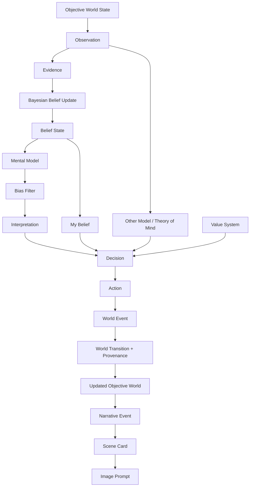

<div align="center">

# StoryWorld V2

### Social Cognitive World Model for Explainable Dynamic Narrative

一个以动态叙事为应用出口、以主体认知差异和可追踪世界演化为核心的研究原型。

`Python 3.10+` · `Pydantic 2.x` · `Explainable AI` · `Multi-Agent Cognition` · `Dynamic Narrative`

</div>

---

## 项目简介

StoryWorld V2 研究的不是“如何直接生成一个故事”，而是一个更基础的问题：

> 当多个主体生活在同一个客观世界中，他们如何因为观察范围、证据判断、既有信念、价值取向和对他人的理解不同，形成不同解释，采取不同动作，并共同改变未来世界？

项目将世界事实、主体认知、决策行为与叙事表达拆成独立但可追踪的层级。故事、场景卡和图像提示词是模型运行结果的表达层，不是反向操纵世界状态的决策中心。

与旧版 `WorldState -> PlotEngine -> EventCard` 的线性链路相比，V2 已形成一条从客观事实到多主体行动，再回写客观世界的闭环。

## 当前进度

目前已完成 40 天计划的前 9 天，核心研究链路可以端到端运行。

| 阶段 | 已完成能力 | 状态 |
| --- | --- | :---: |
| Day 1-3 | 客观世界、主体认知与观察模型 | 完成 |
| Day 4 | Evidence 与 Belief State | 完成 |
| Day 5 | Candidate Future 与结构化输出 | 完成 |
| Day 6 | 差异化 Interpretation 与 State Provenance | 完成 |
| Day 7 | Mental Model、Bias Filter、Cognitive Interpretation Layer | 完成 |
| Day 8 | Bayesian Belief Update、Value System、Decision、Action、Event | 完成 |
| Day 9 | Theory of Mind、Other Model 与 World Update 闭环 | 完成 |
| Day 10 | Same World, Different Minds 正式实验 | 下一步 |

当前基线包含 1 个共享客观世界、2 个角色、3 种认知 Lens，以及每个时间步 4 条候选未来。测试集还覆盖 Dataist、Institutionalist 和 Skeptic 三类认知配置，用于验证同一事实如何产生差异化判断。

## 核心链路



### 信息边界

系统明确区分三类信息，避免“角色知道一切”或“叙事文本偷偷改写事实”：

| 层级 | 表示内容 | 典型结构 |
| --- | --- | --- |
| 客观层 | 世界中真实存在的主体、关系、制度、过程和事件 | `ObjectiveWorldState` |
| 主观层 | 某个主体实际观察到、相信、误判或推断的内容 | `Observation`、`BeliefState`、`MentalModel` |
| 表达层 | 将已发生的世界变化组织为可阅读、可视化的叙事结果 | `NarrativeEvent`、`SceneCard`、`ImagePrompt` |

## 已实现能力

### 1. 客观社会世界

`ObjectiveWorldState` 保存 Agents、Relationships、Institutions、Active Processes 和 State Provenance。所有世界更新都通过结构化事件发生，并记录前置状态、变化内容和来源，便于回放与因果检查。

### 2. 部分可观察性

每个角色只能从自身位置、权限和注意力范围内生成 Observation。观察结果不会自动等同于事实，而会进一步转换为具有来源、可靠度和支持方向的 Evidence。

### 3. 贝叶斯信念更新

Evidence 进入 Bayesian Belief Update 后更新 Belief State。模型同时保留先验、似然、后验和证据引用，使“角色为什么相信这件事”成为可查询的数据，而不是隐藏在生成文本里。

### 4. 认知解释层

解释过程遵循：

```text
Observation -> Belief -> Mental Model -> Bias Filter -> Interpretation
```

`Interpretation` 包含 `agent_id`、`observation_ids`、`belief_basis`、`causal_frame`、`meaning`、`emotional_response` 和 `action_implication`。因此，同一条“网络监控增强”观察可以被理解为自治权威胁、制度安全措施，或证据不足的暂定信号。

### 5. Theory of Mind

主体不仅使用自己的信念，也会建立对其他主体的模型：对方可能相信什么、想要什么、会采取什么行动，以及这一判断有多可信。`BeliefAboutOther` 进入决策评分，使策略选择能够体现预期协作、阻力与风险。

### 6. 决策、行动与世界回写

系统从多种 Lens 生成 Candidate Futures，结合 Value System、Belief State、Interpretation 和 Other Model 进行评分，选择 Decision 并执行 Action。Action 生成 World Event，随后由 World Transition 更新客观状态并写入 Provenance，形成真正闭合的演化循环。

## 差异化效果示例

面对相同的校园网络监控事实，不同认知配置会形成不同输出：

| 认知配置 | 关注重点 | 可能解释 | 行动倾向 |
| --- | --- | --- | --- |
| Dataist | 技术信号、数据异常、证据链 | 监控强度上升，需要验证真实用途 | 秘密收集证据 |
| Institutionalist | 规则、秩序、组织合法性 | 制度可能在执行风险控制 | 谨慎沟通或支持规范流程 |
| Skeptic | 信息缺口、来源可靠性 | 当前证据不足，结论仍需保留 | 延迟判断并寻求交叉验证 |

当前示例角色为林夏与王晨。林夏在评估秘密调查时，会同时考虑王晨可能反对公开对抗的倾向；这个 Other Model 会以独立调整项进入候选行动评分，而不只是出现在最终叙述中。

## 快速开始

### 环境要求

- Python 3.10 或更高版本
- Pydantic 2.x

### 安装依赖

```bash
python -m pip install -r requirements.txt
```

### 运行默认实验

```bash
python app.py
```

### 自定义世界描述和演化步数

```bash
python app.py \
  --input "校园监控：学校部署不透明的网络异常流量检测系统。" \
  --steps 3
```

Windows PowerShell 可以写成一行：

```powershell
python app.py --input "校园监控：学校部署不透明的网络异常流量检测系统。" --steps 3
```

仅在终端查看结果、不写入 `outputs/`：

```bash
python app.py --no-export
```

### 作为 Python 模块调用

```python
from app import run_pipeline

result = run_pipeline(
    "校园监控：学校部署不透明的网络异常流量检测系统。",
    steps=3,
    export=True,
)

print(result["run_dir"])
```

## 输出说明

每次导出会创建独立目录 `outputs/run_XXX/`，避免覆盖之前的实验。当前一次完整运行会产生 22 个 JSON 文件和 1 份 Markdown 报告。

| 分组 | 文件 | 用途 |
| --- | --- | --- |
| 世界与主体 | `objective_states.json`、`agent_profiles.json` | 保存共享世界快照与主体配置 |
| 观察与证据 | `observations.json`、`evidence.json` | 记录主体看到什么，以及证据如何支持判断 |
| 信念更新 | `belief_updates.json`、`belief_states.json` | 保存先验、后验及每步信念状态 |
| 主观认知 | `subjective_models.json`、`mental_models.json`、`bias_filter_results.json`、`interpretations.json` | 展示从认知框架到解释的完整过程 |
| 他心模型 | `beliefs_about_others.json` | 保存主体对其他主体信念、目标与动作的预测 |
| 未来推演 | `hypotheses.json`、`candidate_futures.json`、`selected_futures.json` | 保存机制假设和候选世界走向 |
| 决策与行动 | `value_assessments.json`、`decisions.json`、`actions.json` | 解释为何选择某项行动以及如何执行 |
| 世界变化 | `world_events.json` | 记录行动产生的客观事件和状态更新依据 |
| 叙事表达 | `narrative_events.json`、`scene_cards.json`、`image_prompts.json` | 将世界变化转换为叙事与视觉生成输入 |
| 汇总报告 | `report.md` | 提供适合人工阅读的本次运行摘要 |

`outputs/` 默认不纳入 Git。它用于保存本地实验产物，建议在比较不同认知配置或模型版本时保留对应的 `run_XXX` 目录。

## 项目结构

```text
.
├── app.py                    # CLI 与端到端运行入口
├── config.py                 # 默认步数、输出目录和模型配置
├── schemas/                  # Pydantic 数据契约
├── core/                     # 认知、推演、决策和世界更新逻辑
├── narrative/                # NarrativeEvent、SceneCard 与 ImagePrompt 生成
├── examples/                 # 校园监控示例世界与角色配置
├── tests/                    # Schema、认知链路与端到端测试
├── outputs/                  # 本地实验导出目录
└── StoryWorld_V2_docs/       # 研究设计、架构说明与 40 天计划
```

## 测试

运行完整测试集：

```bash
python -m unittest discover -v
```

当前共有 30 项自动化测试，覆盖：

- Pydantic Schema 校验与跨对象引用。
- Observation、Evidence、Belief Update 和 Interpretation 链路。
- 三类认知配置下的差异化解释。
- Theory of Mind 对决策评分的实际影响。
- Action、World Event、World Update 与 State Provenance。
- NarrativeEvent、SceneCard、ImagePrompt 和完整导出结果。

## 研究原则

- **客观世界与主观世界分离**：角色的信念可以错误，但不能悄悄成为世界事实。
- **认知过程可追踪**：重要判断保留 observation、evidence、belief 和 causal basis。
- **同世界、多心智**：差异来自主体模型，而不是为每个角色偷偷创建不同世界。
- **决策必须产生后果**：动作进入事件系统，并真正改变下一步世界状态。
- **叙事层只负责表达**：文本生成不能跳过规则直接篡改事实或选择结果。
- **结构化优先**：核心过程使用 Pydantic Schema，便于验证、复现实验和替换模型。

## 路线图与文档

- [`StoryWorld_V2_docs/11_development_roadmap_40_days.md`](StoryWorld_V2_docs/11_development_roadmap_40_days.md)：40 天研究版路线图，描述实验目标、里程碑和验收标准。
- [`StoryWorld_V2_docs/11_development_roadmap_40_days(1).md`](StoryWorld_V2_docs/11_development_roadmap_40_days%281%29.md)：每日详细执行版，包含逐日任务与交付物。
- [`StoryWorld_V2_docs/02_core_architecture.md`](StoryWorld_V2_docs/02_core_architecture.md)：系统分层、模块边界和核心数据流。
- [`StoryWorld_V2_docs/06_causal_future_engine.md`](StoryWorld_V2_docs/06_causal_future_engine.md)：因果假设、候选未来与演化约束。
- [`StoryWorld_V2_docs/07_narrative_engine.md`](StoryWorld_V2_docs/07_narrative_engine.md)：从世界变化到叙事表达的约束。
- [`StoryWorld_V2_docs/08_data_schema.md`](StoryWorld_V2_docs/08_data_schema.md)：主要 Schema、字段语义与数据契约。
- [`StoryWorld_V2_docs/09_module_design.md`](StoryWorld_V2_docs/09_module_design.md)：Python 模块职责和代码组织。
- [`StoryWorld_V2_docs/10_testing_and_evaluation.md`](StoryWorld_V2_docs/10_testing_and_evaluation.md)：差异化认知、消融与基线评估方法。

## 当前边界

StoryWorld V2 仍是研究原型，而不是完整的生产级叙事平台。当前版本使用确定性规则和 mock structured model 保证实验可复现；校园场景的 Candidate Future 生成器仍包含领域特定逻辑；Theory of Mind 暂不支持递归心智推理；Hypothesis Conflict Resolver、正式对照实验和通用机制语言仍在后续计划中。

这些限制是当前实验边界，也构成下一阶段最重要的验证方向。

---

<div align="center">

**同一个世界，不同的心智；每一次行动，都留下可追踪的未来。**

</div>
