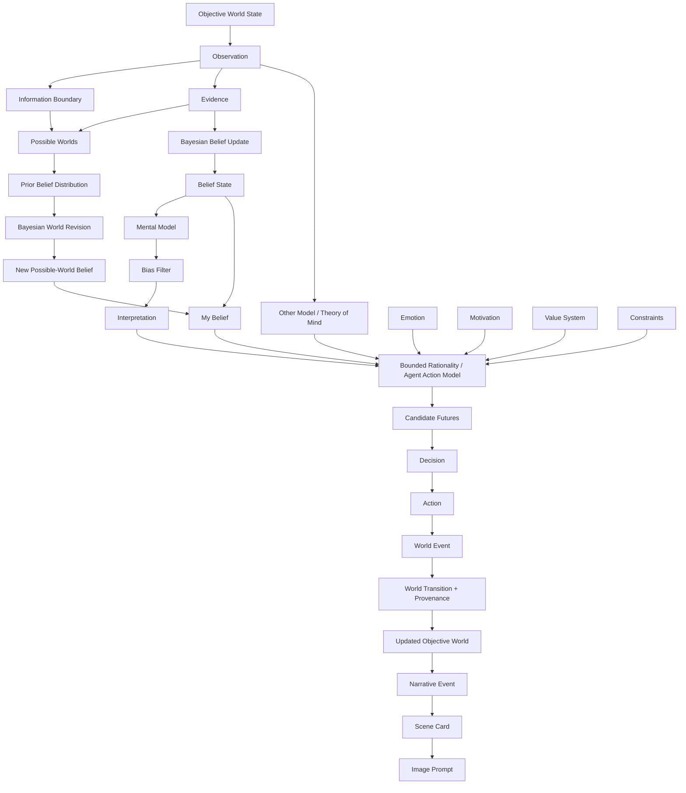

<div align="center">

# StoryWorld V2

### Social Cognitive World Model for Explainable Dynamic Narrative

一个以动态叙事为应用出口、以主体认知差异和可追踪世界演化为核心的研究原型。

`Python 3.10+` · `Pydantic 2.x` · `Explainable AI` · `Multi-Agent Cognition` · `Dynamic Narrative`

</div>

---

## 项目简介

StoryWorld V2 研究的不是“如何直接生成一个故事”，而是一个更基础的问题：

> 当多个主体生活在同一个客观世界中，他们如何因为观察范围、证据判断、既有信念、价值取向和对他人的理解不同，形成不同解释，采取不同动作，并共同改变未来世界？

项目将世界事实、主体认知、决策行为与叙事表达拆成独立但可追踪的层级。故事、场景卡和图像提示词是模型运行结果的表达层，不是反向操纵世界状态的决策中心。

与旧版 `WorldState -> PlotEngine -> EventCard` 的线性链路相比，V2 已形成一条从客观事实到多主体行动，再回写客观世界的闭环。

## 当前进度

目前已完成 40 天计划的前 30 天，核心研究链路可以连续演化 3-5 步，并已完成主体认知、Lens 消融和主观世界模型消融实验。

| 阶段 | 已完成能力 | 状态 |
| --- | --- | :---: |
| Day 1-3 | 客观世界、主体认知与观察模型 | 完成 |
| Day 4 | Evidence 与 Belief State | 完成 |
| Day 5 | Candidate Future 与结构化输出 | 完成 |
| Day 6 | 差异化 Interpretation 与 State Provenance | 完成 |
| Day 7 | Mental Model、Bias Filter、Cognitive Interpretation Layer | 完成 |
| Day 8 | Bayesian Belief Update、Value System、Decision、Action、Event | 完成 |
| Day 9 | Theory of Mind、Other Model 与 World Update 闭环 | 完成 |
| Day 10 | Same World, Different Minds 正式实验 | 完成 |
| Day 11 | 因果推理基础与 Causal Notes | 完成 |
| Day 12 | CausalHypothesis Schema 强化 | 完成 |
| Day 13-14 | Psychology Lens 与心理行动链 | 完成 |
| Day 15-16 | Economic Lens 与约束下行动评估 | 完成 |
| Day 17-18 | Social Structure Lens 与社会智能体链 | 完成 |
| Day 19 | Lens Router 与 Hypothesis Conflict Resolver | 完成 |
| Day 20 | Lens Ablation 实验 | 完成 |
| Day 21 | Possible Worlds、Belief Distribution 与 Candidate Future 溯源 | 完成 |
| Day 22-23 | 机制差异化 Future Generator | 完成 |
| Day 24 | Bounded Rationality Agent Action Model | 完成 |
| Day 25-26 | Future Evaluator 强化 | 完成 |
| Day 27-28 | 原子化 World Transition 与完整 State Provenance | 完成 |
| Day 29 | 3-5 步连续 World Simulation | 完成 |
| Day 30 | 有/无 Subjective Model 受控实验 | 完成 |

当前基线包含 1 个共享客观世界、2 个角色、3 种认知 Lens，以及每个时间步 4 条候选未来。测试集还覆盖 Dataist、Institutionalist 和 Skeptic 三类认知配置，用于验证同一事实如何产生差异化判断。

## 核心链路


```mermaid
flowchart TD
    W[Objective World State] --> O[Observation]
    O --> IB[Information Boundary]
    O --> E[Evidence]
    IB --> PW[Possible Worlds]
    E --> PW
    PW --> PBD[Prior Belief Distribution]
    PBD --> BWR[Bayesian World Revision]
    BWR --> NWB[New Possible-World Belief]
    E --> BBU[Bayesian Belief Update]
    BBU --> BS[Belief State]
    BS --> MM[Mental Model]
    MM --> BF[Bias Filter]
    BF --> I[Interpretation]

    BS --> MB[My Belief]
    NWB --> MB
    O --> OM[Other Model / Theory of Mind]
    MB --> BR[Bounded Rationality / Agent Action Model]
    OM --> BR
    I --> BR
    EM[Emotion] --> BR
    MOT[Motivation] --> BR
    VS[Value System] --> BR
    C[Constraints] --> BR
    BR --> CF[Candidate Futures]
    CF --> D[Decision]

    D --> A[Action]
    A --> WE[World Event]
    WE --> WT[World Transition + Provenance]
    WT --> W2[Updated Objective World]

    W2 --> NE[Narrative Event]
    NE --> SC[Scene Card]
    SC --> IP[Image Prompt]
```

### 信息边界

系统明确区分三类信息，避免“角色知道一切”或“叙事文本偷偷改写事实”：

| 层级 | 表示内容 | 典型结构 |
| --- | --- | --- |
| 客观层 | 世界中真实存在的主体、关系、制度、过程和事件 | `ObjectiveWorldState` |
| 主观层 | 某个主体实际观察到、相信、误判或推断的内容 | `Observation`、`BeliefState`、`MentalModel` |
| 表达层 | 将已发生的世界变化组织为可阅读、可视化的叙事结果 | `NarrativeEvent`、`SceneCard`、`ImagePrompt` |

## 已实现能力

### 1. 客观社会世界

`ObjectiveWorldState` 保存 Agents、Relationships、Institutions、Active Processes 和 State Provenance。所有世界更新都通过结构化事件发生，并记录前置状态、变化内容和来源，便于回放与因果检查。

### 2. 部分可观察性

每个角色只能从自身位置、权限和注意力范围内生成 Observation。观察结果不会自动等同于事实，而会进一步转换为具有来源、可靠度和支持方向的 Evidence。

### 3. 贝叶斯信念更新

Evidence 进入 Bayesian Belief Update 后更新 Belief State。模型同时保留先验、似然、后验和证据引用，使“角色为什么相信这件事”成为可查询的数据，而不是隐藏在生成文本里。

### 4. 认知解释层

解释过程遵循：

```text
Observation -> Belief -> Mental Model -> Bias Filter -> Interpretation
```

`Interpretation` 包含 `agent_id`、`observation_ids`、`belief_basis`、`causal_frame`、`meaning`、`emotional_response` 和 `action_implication`。因此，同一条“网络监控增强”观察可以被理解为自治权威胁、制度安全措施，或证据不足的暂定信号。

### 5. Theory of Mind

主体不仅使用自己的信念，也会建立对其他主体的模型：对方可能相信什么、想要什么、会采取什么行动，以及这一判断有多可信。`BeliefAboutOther` 进入决策评分，使策略选择能够体现预期协作、阻力与风险。

### 6. 决策、行动与世界回写

系统从多种 Lens 生成 Candidate Futures，结合 Value System、Belief State、Interpretation 和 Other Model 进行评分，选择 Decision 并执行 Action。Action 生成 World Event，随后由 World Transition 更新客观状态并写入 Provenance，形成真正闭合的演化循环。

### 7. Psychology Lens

心理机制链已经接入真实决策：

```text
World Event
→ Perception
→ Belief
→ Emotional Appraisal
→ Stress
→ Motivation
→ Value Evaluation
→ Decision
→ Action
```

`PsychologyLens` 不再返回固定观点，而是针对每个主体读取实际 Perception、Emotion、Stress 和 Motivation，生成带完整来源 ID 的 `CausalHypothesis`。Motivation alignment 与 Stress adjustment 同时进入 `ValueAssessment`，因此心理状态会改变候选行动评分。

### 8. Economic Lens

经济机制遵循角色的有限信息边界，而不是直接把客观世界的隐藏事实交给角色：

```text
World
→ Information Boundary
→ Belief
→ Motivation + Value Evaluation
→ Decision
→ Action
```

`InformationBoundary` 记录每个角色可见与不可访问的信息、Observation 来源、资源和访问规则。`EconomicEngine` 在该边界内结合 Belief uncertainty、Motivation 与 Value，对每项 Candidate Action 分解 Scarcity、Information Asymmetry、收益、成本和机会成本。最终 Economic Utility 进入 `ValueAssessment.score`，所有结果可沿 ID 追溯至 Decision 与 Action。

### 9. Possible Worlds 与贝叶斯修正

系统不会把单一解释直接当成世界真相。每个主体先在自身 `InformationBoundary` 内建立制度性监控、防御性安全和技术异常三个互斥 `PossibleWorld`，再用可见 `Evidence` 计算似然、排除被硬证据否定的世界，并归一化为后验 `BeliefDistribution`。主导世界形成 `PossibleWorldBelief`，同时保留概率分布和不确定性。

`CandidateFuture` 通过 `source_possible_world_ids`、`source_belief_distribution_ids` 和 `belief_plausibility` 引用这条认识论链。后验概率进入 `FutureEvaluator`，再与 Lens 因果支持、角色一致性、Value 和 Motivation 一起影响 Decision。

### 10. 机制差异化 Future Generator

`FutureGenerator` 每步生成 4 条世界状态分支，而不是同义剧情选项：秘密取证对应 `information_discovery`，同伴求助对应 `social_coordination`，公开质询对应 `institutional_contestation`，延迟行动对应 `process_inertia`。每条分支都包含结构化 `FutureMechanism`、行动、支持与抑制假设、约束、Possible World 后验、风险、不确定性和可实际应用的 `StateChange`。

生成器按 `promotes_actions` / `inhibits_actions` 和 `affected_agents` 选择假设，并由基础率、机制支持、反向约束和 belief plausibility 计算相对可信度。主行动者依据 Subjective Model 动态选择，不再固定为某个角色。

### 11. Bounded Rationality Agent Action Model

`AgentActionModel` 在 Future Generator 之前评估候选动作。每个 `AgentActionDecision` 保存 Belief、Possible World、Goal、Value、Emotion、Motivation、Other Model 与 Constraint 八个分项，以及角色的信息覆盖率、动态 satisficing threshold、考虑顺序和首选动作。模型使用主体边界内的最新 BeliefState，不读取隐藏事实，也不假设角色拥有无限计算能力。

### Future Evaluator

`FutureEvaluator` 为每个候选未来生成结构化 `FutureEvaluation`，评分包含 `causal_support`、`agent_consistency`、`constraint_satisfaction` 和综合 `compatibility`。兼容性继续拆分为世界状态、认识论和行动兼容性；跨 Lens 支持提供加分，正反假设冲突则形成显式惩罚。评估记录引用的假设、关系、约束、动作决策和状态路径，同时保留扁平 `future_scores` 供 Decision Engine 与消融实验兼容使用。

Action score 进入 `CandidateFuture.bounded_rationality_score` 和 Future Evaluation；最终 `Decision` 继续引用对应 `action_decision_id`，形成 `Observation → Belief / Possible Worlds → Emotion → Motivation → Value → Bounded Rationality → Decision → Action` 的闭合链路。

### World Transition

`WorldTransition` 在写入 `State(t+1)` 前统一校验 Candidate Future 来源、StateChange 路径、`old_value`、重复修改、no-op、受保护元数据以及 Action / Decision / Future Evaluation 引用。只有全部检查通过才会在深拷贝状态上原子应用变化，原始 `State(t)` 始终保持不变。

每条 `StateProvenance` 可反向追踪 source/target state、World Event、Future、Future Evaluation、Action、Decision、Agent Action Decision、Value Assessment、正反假设、Lens、Observation、Belief、Goal、Emotion、Motivation、Constraint、Other Model 与 Possible World。World Event 同时通过 `provenance_ids` 指回实际状态变化。

### Multi-step Simulation 与世界模型实验

`MultiStepSimulation` 对 3-5 步 rollout 逐步验证状态连续性、历史快照不可变、StateChange 的 old/new value、no-op 和完整 provenance。当前正式结果形成 `state_000 → state_001 → state_002 → state_003`，三步均通过。

Day30 实验在相同 Objective World、Agent 身份与角色、Observation 边界、Lens、Future 模板和决策权重下，对比完整 Subjective Model 与中性主体消融。中性条件保留接口所需的 Agent 载体，但移除个体知识、既有信念、价值、目标和认识论偏好。结果显示 Belief、Interpretation、Future Score、Action Score 与 provenance 均发生变化；秘密取证仍保持首选，最终事实状态未翻转，表现为形成机制敏感而行动选择稳健。

### 12. Social Structure Lens

社会智能体链将心理状态与社会位置并行汇入决策：

```text
World → Observation → Belief
                    ├→ Psychology: Motivation / Emotion / Bias
                    └→ Society: Role / Norm / Institution
                                      ↓
                              Decision → Action
```

`SocialStructureEngine` 生成逐角色的 Role constraint、Norm pressure 和 Institution power，并为每项候选行动计算 role alignment、norm compliance、institutional risk、social support 与 compatibility。`SocialStructureLens` 按角色动态生成带 provenance 的假设；Social compatibility 以独立分量进入 `ValueAssessment.score`。

### 13. Lens Router 与冲突解析

```text
Objective State
→ Enabled Lenses
→ Hypothesis Pool
→ Support / Conflict / Condition Relations
→ Relation-aware Future Evaluation
```

每个 `CausalHypothesis` 显式声明 `promotes_actions` 和 `inhibits_actions`。`HypothesisConflictResolver` 据此生成结构化 `HypothesisRelation`，记录 `supports`、`contradicts` 或 `conditions`、关系强度、共享驱动与解析状态。冲突不会被强行消解，而是以 `unresolved` 状态保留。`FutureEvaluator` 使用假设置信度和关系质量评分，相同数量的相互支持假设会高于相互冲突假设。

## 差异化效果示例

面对相同的校园网络监控事实，不同认知配置会形成不同输出：

| 认知配置 | 关注重点 | 可能解释 | 行动倾向 |
| --- | --- | --- | --- |
| Dataist | 技术信号、数据异常、证据链 | 监控强度上升，需要验证真实用途 | 秘密收集证据 |
| Institutionalist | 规则、秩序、组织合法性 | 制度可能在执行风险控制 | 谨慎沟通或支持规范流程 |
| Skeptic | 信息缺口、来源可靠性 | 当前证据不足，结论仍需保留 | 延迟判断并寻求交叉验证 |

当前示例角色为林夏与王晨。林夏在评估秘密调查时，会同时考虑王晨可能反对公开对抗的倾向；这个 Other Model 会以独立调整项进入候选行动评分，而不只是出现在最终叙述中。

## 快速开始

### 环境要求

- Python 3.10 或更高版本
- Pydantic 2.x

### 安装依赖

```bash
python -m pip install -r requirements.txt
```

### 运行默认实验

```bash
python app.py
```

### 自定义世界描述和演化步数

```bash
python app.py \
  --input "校园监控：学校部署不透明的网络异常流量检测系统。" \
  --steps 3
```

Windows PowerShell 可以写成一行：

```powershell
python app.py --input "校园监控：学校部署不透明的网络异常流量检测系统。" --steps 3
```

仅在终端查看结果、不写入 `outputs/`：

```bash
python app.py --no-export
```

### 作为 Python 模块调用

```python
from app import run_pipeline

result = run_pipeline(
    "校园监控：学校部署不透明的网络异常流量检测系统。",
    steps=3,
    export=True,
)

print(result["run_dir"])
```

## 输出说明

每次导出会创建独立目录 `outputs/run_XXX/`，避免覆盖之前的实验。当前一次完整运行会产生 45 个 JSON 文件和 1 份 Markdown 报告，其中 `future_evaluations.json` 保存候选未来的完整评分分解，`state_provenance.json` 独立保存状态变化因果链。

| 分组 | 文件 | 用途 |
| --- | --- | --- |
| 世界与主体 | `objective_states.json`、`state_provenance.json`、`agent_profiles.json` | 保存共享世界快照、状态变化因果链与主体配置 |
| 观察与证据 | `observations.json`、`evidence.json` | 记录主体看到什么，以及证据如何支持判断 |
| 信念更新 | `belief_updates.json`、`belief_states.json` | 保存先验、后验及每步信念状态 |
| 可能世界 | `possible_worlds.json`、`world_evidence_assessments.json`、`prior_belief_distributions.json`、`world_revisions.json`、`posterior_belief_distributions.json`、`possible_world_beliefs.json` | 保存信息边界内的候选解释、证据似然、淘汰结果、贝叶斯修正与新信念 |
| 主观认知 | `subjective_models.json`、`mental_models.json`、`bias_filter_results.json`、`interpretations.json` | 展示从认知框架到解释的完整过程 |
| 心理机制 | `perceptions.json`、`emotional_appraisals.json`、`stress_states.json`、`motivation_states.json` | 展示事件如何通过心理状态进入价值评估和决策 |
| 经济机制 | `information_boundaries.json`、`scarcity_assessments.json`、`information_asymmetries.json`、`incentive_assessments.json`、`opportunity_costs.json`、`economic_action_evaluations.json` | 展示角色的信息边界、信念和动机如何改变行动的收益、成本及相对效用 |
| 社会结构 | `role_assessments.json`、`norm_pressures.json`、`institution_powers.json`、`social_action_evaluations.json` | 展示角色、规范、制度权力与社会支持如何改变行动适配度 |
| 他心模型 | `beliefs_about_others.json` | 保存主体对其他主体信念、目标与动作的预测 |
| 未来推演 | `hypotheses.json`、`hypothesis_relations.json`、`candidate_futures.json`、`selected_futures.json` | 保存机制假设、跨 Lens 关系和候选世界走向 |
| 决策与行动 | `agent_action_decisions.json`、`value_assessments.json`、`decisions.json`、`actions.json` | 展示有限理性行动考虑、最终选择及执行结果 |
| 世界变化 | `world_events.json` | 记录行动产生的客观事件和状态更新依据 |
| 叙事表达 | `narrative_events.json`、`scene_cards.json`、`image_prompts.json` | 将世界变化转换为叙事与视觉生成输入 |
| 汇总报告 | `report.md` | 提供适合人工阅读的本次运行摘要 |

`outputs/` 默认不纳入 Git。它用于保存本地实验产物，建议在比较不同认知配置或模型版本时保留对应的 `run_XXX` 目录。

## 项目结构

```text
.
├── app.py                    # CLI 与端到端运行入口
├── config.py                 # 默认步数、输出目录和模型配置
├── schemas/                  # Pydantic 数据契约
├── core/                     # 认知、推演、决策、叙事和世界更新逻辑
├── data/examples/            # 校园监控示例世界与角色配置
├── experiments/              # 可重复实验运行器与结构化实验结果
├── tests/                    # Schema、认知链路与端到端测试
├── outputs/                  # 本地实验导出目录
└── StoryWorld_V2_docs/       # 研究设计、架构说明与 40 天计划
```

## 测试

运行完整测试集：

```bash
python -m unittest discover -v
```

当前共有 114 项自动化测试，覆盖：

- Pydantic Schema 校验与跨对象引用。
- Observation、Evidence、Belief Update 和 Interpretation 链路。
- 三类认知配置下的差异化解释。
- Theory of Mind 对决策评分的实际影响。
- Action、World Event、World Update 与 State Provenance。
- NarrativeEvent、SceneCard、ImagePrompt 和完整导出结果。
- Same World Different Minds、参数交换和 Partial Observability 对照。
- World Event 到 Action 的心理链路、主体差异和隐藏事件边界。
- Information Boundary、Belief、Motivation、Value 到 Action 的角色经济链及经济反事实。
- Psychology 与 Society 双分支、Role / Norm / Institution provenance 及制度权力反事实。
- 跨 Lens 支持、冲突、条件关系，未解决冲突和关系感知 Future 评分。
- Psychology、Economic、SocialStructure 的单 Lens 消融、模块无泄漏与确定性实验导出。
- Possible Worlds 的信息隔离、概率归一化、硬证据淘汰、后验新信念与 Candidate Future 评分接入。
- Future Generator 的机制多样性、正反假设绑定、动态行动者、真实状态分支和机制消融。
- Bounded Rationality 的八维行动分解、satisficing、信息边界、约束与 Possible World 反事实，以及 Action Model 到最终 Action 的引用闭环。
- 3-5 步状态连续性、快照不可变、逐步 provenance 闭合与确定性复跑。
- 有/无 Subjective Model 的受控消融，以及 Belief、Interpretation、Future / Action Score 和最终状态差异。

运行 Day 10 正式实验：

```bash
python -m experiments.same_world_different_minds
```

实验会生成机器可读的 [`experiment_01.json`](experiments/results/experiment_01.json) 和人工可读的 [`experiment_01.md`](experiments/results/experiment_01.md)。当前结果中 Observation 等价率、Belief 差异率、Interpretation 差异率和 Action 差异率均为 `1.000`。

运行 Day 20 Lens 消融实验：

```bash
python -m experiments.lens_ablation
```

实验生成 [`lens_ablation.json`](experiments/results/lens_ablation.json) 与 [`lens_ablation.md`](experiments/results/lens_ablation.md)。移除任一 Lens 都会改变 Hypothesis Pool、关系图、Future 分数、Action 分数和最终状态 provenance；当前场景中秘密取证仍保持第一名，表现为机制敏感但最终选择稳健。

运行 Day29 多步模拟验收：

```bash
python -m experiments.multi_step_simulation --steps 3
```

结果见 [`multi_step_simulation.json`](experiments/results/multi_step_simulation.json) 与 [`multi_step_simulation.md`](experiments/results/multi_step_simulation.md)。运行器支持 3-5 步，并验证状态链、快照、StateChange 与 provenance。

运行 Day30 世界模型消融实验：

```bash
python -m experiments.world_model_ablation --steps 3
```

结果见 [`world_model_ablation.json`](experiments/results/world_model_ablation.json) 与 [`world_model_ablation.md`](experiments/results/world_model_ablation.md)。当前所有控制与差异指标通过；Action 与最终事实状态保持稳定，但认知、评分和 provenance 轨迹发生变化。

## 研究原则

- **客观世界与主观世界分离**：角色的信念可以错误，但不能悄悄成为世界事实。
- **认知过程可追踪**：重要判断保留 observation、evidence、belief 和 causal basis。
- **同世界、多心智**：差异来自主体模型，而不是为每个角色偷偷创建不同世界。
- **决策必须产生后果**：动作进入事件系统，并真正改变下一步世界状态。
- **叙事层只负责表达**：文本生成不能跳过规则直接篡改事实或选择结果。
- **结构化优先**：核心过程使用 Pydantic Schema，便于验证、复现实验和替换模型。

## 路线图与文档

- [`StoryWorld_V2_docs/11_development_roadmap_40_days.md`](StoryWorld_V2_docs/11_development_roadmap_40_days.md)：40 天研究版路线图，描述实验目标、里程碑和验收标准。
- [`StoryWorld_V2_docs/11_development_roadmap_40_days(1).md`](StoryWorld_V2_docs/11_development_roadmap_40_days%281%29.md)：每日详细执行版，包含逐日任务与交付物。
- [`StoryWorld_V2_docs/02_core_architecture.md`](StoryWorld_V2_docs/02_core_architecture.md)：系统分层、模块边界和核心数据流。
- [`StoryWorld_V2_docs/06_causal_future_engine.md`](StoryWorld_V2_docs/06_causal_future_engine.md)：因果假设、候选未来与演化约束。
- [`StoryWorld_V2_docs/07_narrative_engine.md`](StoryWorld_V2_docs/07_narrative_engine.md)：从世界变化到叙事表达的约束。
- [`StoryWorld_V2_docs/08_data_schema.md`](StoryWorld_V2_docs/08_data_schema.md)：主要 Schema、字段语义与数据契约。
- [`StoryWorld_V2_docs/09_module_design.md`](StoryWorld_V2_docs/09_module_design.md)：Python 模块职责和代码组织。
- [`StoryWorld_V2_docs/10_testing_and_evaluation.md`](StoryWorld_V2_docs/10_testing_and_evaluation.md)：差异化认知、消融与基线评估方法。
- [`notebooks/causal_notes.md`](notebooks/causal_notes.md)：Cause、Driver、Mediator、Constraint 与反事实建模笔记。

## 当前边界

StoryWorld V2 仍是研究原型，而不是完整的生产级叙事平台。当前版本使用确定性规则和 mock structured model 保证实验可复现；校园场景的 Candidate Future 生成器仍包含领域特定逻辑；Theory of Mind 暂不支持递归心智推理；Prompt-to-Story Baseline Comparison 和通用机制语言仍在后续计划中。

这些限制是当前实验边界，也构成下一阶段最重要的验证方向。

---

<div align="center">

**同一个世界，不同的心智；每一次行动，都留下可追踪的未来。**

</div>
